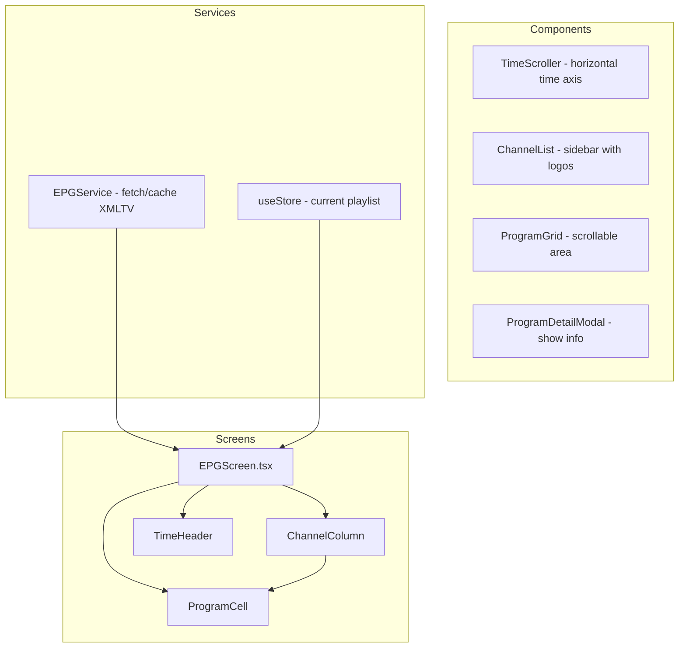
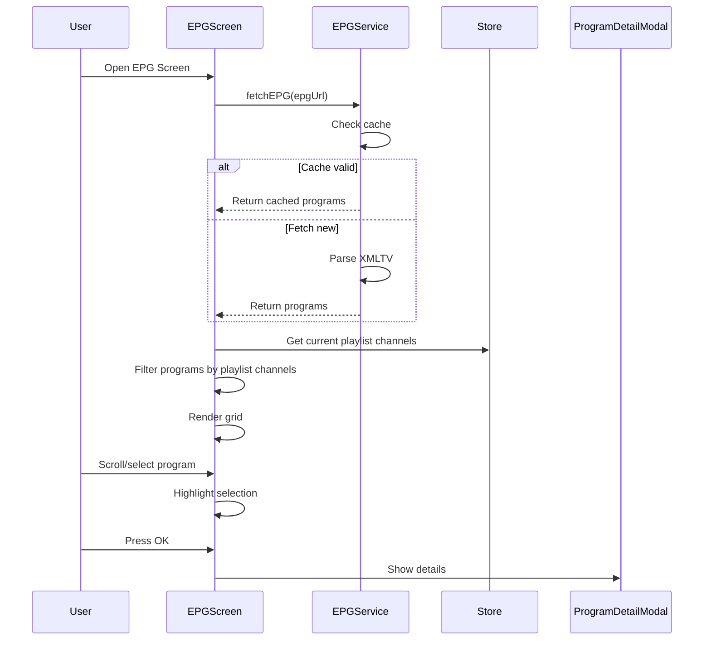

# EPG Grid Screen Design

## Overview

Design a full Electronic Program Guide (EPG) grid screen that displays channel schedules in a timeline view, allowing users to browse programs, see what's playing now/next, and tap to switch channels.

## Architecture



## Files to Create

| File | Purpose |
|------|---------|
| `src/screens/EPGScreen.tsx` | Main EPG grid screen |
| `src/components/epg/` | EPG components directory |
| `src/services/EPGService.ts` | Extend existing service |
| `src/types/index.ts` | Add EPG-specific types |

## Screen Layout

```
+------------------------------------------------------------------+
|  [Back]  Program Guide                           [Date Picker]  >  |
+------------------------------------------------------------------+
| 12:00 | 1:00 | 2:00 | 3:00 | 4:00 | 5:00 | 6:00 | 7:00 | Now  |
|-------|------|------|------|------|------|------|------|------|
| [+TV] | ████████████████████████ Game Show                    |
|       | CNN                                              |
|-------|--------------------------------------------------|------|
| [+Sports]| ██████████████████ Sports Central            |
|       | ESPN                                            |
|-------|------------------------------------------|--------|------|
| [+Movies] ██████████ Movie Title                    |
|       | HBO                                             |
|-------|----------------------------------------|--------|------|
| [Channel 4]                                      |
+-------+--------------------------------------------+--------+
| [< Prev Channel]  [Watch Now]  [More Info]                  |
+------------------------------------------------------------------+
```

## Components

### 1. EPGScreen.tsx (Main Container)

**State:**
```typescript
interface EPGState {
  programs: Map<string, EPGProgram[]>; // channelId -> programs
  currentTime: Date;
  selectedDate: Date;
  selectedChannel: Channel | null;
  selectedProgram: EPGProgram | null;
  timeOffset: number; // hours from current time (0 = now)
  isLoading: boolean;
  error: string | null;
}
```

**Navigation:**
- Add to `App.tsx` stack: `Stack.Screen name="EPG" component={EPGScreen}`
- Add button to `HomeScreen.tsx` header: "Guide" button

### 2. TimeHeader Component

- Horizontal scrollable time axis
- Shows hour markers (12:00, 1:00, 2:00...)
- Current time indicator (red line)
- Supports +/- 24 hours from current
- Time slot width: 120px per hour

### 3. ChannelList Component (Sidebar)

- Fixed width: 120px
- Shows channel logo + name
- Scrolls vertically with programs
- Sticky header for channel names
- Favorite indicator (star)
- Currently playing indicator

### 4. ProgramGrid Component

- Horizontal scroll (time) + vertical scroll (channels)
- Program cells with:
  - Title (truncated)
  - Start/end times
  - Genre color coding
- Current time indicator (red line)
- Selection highlight

### 5. ProgramDetailModal

Shows when pressing OK on a program:
- Full title
- Description
- Start/End time
- Genre/category
- "Watch Channel" button
- "Set Reminder" button (future feature)

## Data Flow



## Type Extensions

```typescript
// src/types/index.ts additions

export interface EPGProgram {
  start: Date;
  end: Date;
  title: string;
  description?: string;
  channelId: string;
  genre?: string;
  episode?: string;
  rating?: string;
}

export interface EPGChannel {
  channel: Channel;
  currentProgram: EPGProgram | null;
  upcomingPrograms: EPGProgram[];
}

export interface EPGGenreColor {
  [genre: string]: string;
}

export const EPG_GENRES: EPGGenreColor = {
  'News': '#FF6B6B',
  'Sports': '#4ECDC4',
  'Movie': '#9B59B6',
  'Entertainment': '#F39C12',
  'Kids': '#3498DB',
  'Music': '#E74C3C',
  'Documentary': '#1ABC9C',
  'Default': '#95A5A6',
};
```

## EPGService Extensions

```typescript
// New methods to add to EPGService

static getProgramsForChannels(
  allPrograms: EPGProgram[],
  channelIds: string[],
  startTime: Date,
  endTime: Date
): Map<string, EPGProgram[]>

static getProgramsAtTime(
  allPrograms: EPGProgram[],
  channelIds: string[],
  time: Date
): Map<string, EPGProgram | null>

static getChannelSchedule(
  allPrograms: EPGProgram[],
  channelId: string,
  startTime: Date,
  endTime: Date
): EPGProgram[]

static formatProgramDuration(start: Date, end: Date): string
```

## Performance Considerations

1. **Virtualized List**: Use `FlashList` or `FlatList` with windowing
2. **Lazy Loading**: Load programs for visible channels only
3. **Caching**: Already implemented (1 hour cache)
4. **Memoization**: Use `useMemo` for program filtering
5. **Pagination**: Fetch EPG in chunks if large

## TV Remote Controls

| Input | Action |
|-------|--------|
| D-pad Up/Down | Navigate channels |
| D-pad Left/Right | Navigate time slots |
| OK/Select | Show program details |
| Back | Return to previous screen |
| Number keys | Quick channel jump (optional) |

## Implementation Steps

1. **Step 1**: Create `EPGScreen.tsx` basic structure
2. **Step 2**: Add EPG navigation to App.tsx and HomeScreen
3. **Step 3**: Implement TimeHeader component
4. **Step 4**: Implement ChannelList sidebar
5. **Step 5**: Implement ProgramGrid with FlatList
6. **Step 6**: Connect to EPGService for data
7. **Step 7**: Add ProgramDetailModal
8. **Step 8**: Style for TV (10-foot UI)
9. **Step 9**: Add remote control support
10. **Step 10**: Test with real XMLTV data

## Styling (TV-Optimized)

```typescript
const EPG_STYLES = {
  timeSlotWidth: 120,
  channelRowHeight: 80,
  headerHeight: 60,
  sidebarWidth: 140,
  programMinWidth: 60,
  backgroundColor: '#1a1a1a',
  textColor: '#FFFFFF',
  highlightColor: '#007AFF',
  currentTimeColor: '#FF3B30',
};
```

## Future Enhancements

- **Reminders**: Push notification before program starts
- **Recording**: Queue programs for recording (requires backend)
- **Search**: Find programs by title/genre
- **Filter**: Show only sports, movies, etc.
- **Categories**: Group channels by category
- **Favorites**: Highlight favorite channels in list
- **On Now/Next**: Quick view of current programs
- **Multi-day**: Date picker for future EPG
