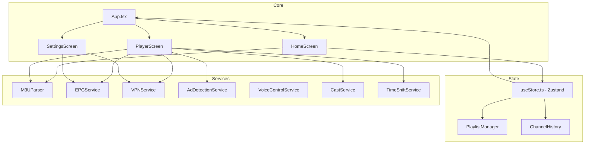

# IPTV Viewer - Feature Planning Document

## Current Project State

### Working Features
- **Core Playback**: M3U playlist support, video playback with react-native-video
- **Channel Management**: Add/remove playlists, favorites with persistence, search & filter
- **Previous Channel**: One-click switching to previously watched channel
- **EPG Integration**: XMLTV support with program info display
- **UI/UX**: Auto-hide controls, volume/mute controls, TV-optimized dark theme
- **Settings**: Playlist management, ad detection config, VPN UI

### Partially Working / Needs Attention
- **VPN**: UI exists, but connection is simulated (needs WireGuard native implementation)
- **Module System**: Installation works, but module execution is disabled for security
- **Remote Control**: D-pad Select button not wired to previous channel

---

## Recommended Improvements

### Phase 1: Stability & Core Improvements

#### 1.1 Fix D-pad Remote Control Integration
**Problem**: D-pad "Select" button is not wired to previous channel functionality
**Solution**: Add TVEventHandler support for remote navigation
**Files to modify**: `PlayerScreen.tsx`
**Approach**:
- Add TV remote event listener using `TVEventHandler` or platform-specific API
- Map D-pad Select to `handlePreviousChannel()`
- Consider adding D-pad Up/Down for channel surfing

#### 1.2 Enable Module System Execution
**Problem**: Module execution disabled due to security concerns with `new Function()`
**Solution**: Implement safe module loading
**Options**:
1. Use Metro bundler to bundle modules at build time
2. Implement sandboxed JavaScript execution (e.g., with VM2 or QuickJS)
3. Allow modules as React Native components only (no custom logic)
**Recommended**: Option 3 - restrict modules to UI components with hooks

#### 1.3 Persistent Channel History UI
**Problem**: Channel history tracked (50 entries) but not visible in UI
**Solution**: Add "Recently Watched" section on HomeScreen
**Files to modify**: `HomeScreen.tsx`, `useStore.ts`
**Approach**:
- Add "Recent" filter button next to All/Favorites
- Display last 10 watched channels with timestamps

---

### Phase 2: Enhanced Playback Features

#### 2.1 Picture-in-Picture (PiP) Mode
**Platform**: Android TV (supported natively)
**Files to modify**: `PlayerScreen.tsx`, `App.tsx`
**Approach**:
- Use `android:supportsPictureInPicture` in AndroidManifest
- Handle PiP lifecycle events
- Show mini player overlay when PiP active

#### 2.2 Multi-Audio & Subtitle Support
**Problem**: Current player doesn't support audio track selection
**Solution**: Extend PlayerScreen controls
**Approach**:
- Access `onAudioTracks` and `onTextTracks` callbacks from react-native-video
- Add audio/subtitle selection modal
- Store user preferences per channel

#### 2.3 Time-Shift Buffer
**Ability to pause live TV and resume from where left off
**Files to modify**: `PlayerScreen.tsx`, new `TimeShiftService.ts`
**Approach**:
- Cache last N minutes of stream to local storage
- Implement pause/resume with buffered content
- Show time-shift indicator in player UI

---

### Phase 3: Advanced EPG Features

#### 3.1 Full EPG Grid View
**Problem**: Only shows "Now Playing" info
**Solution**: Implement channel guide grid
**Files to modify**: New `EPGScreen.tsx`, `EPGService.ts`
**Approach**:
- Fetch and parse full XMLTV data
- Display horizontal time grid with channels
- Allow channel switching from grid
- Implement date navigation

#### 3.2 Program Reminders & Recording
**Add ability to set reminders for upcoming shows
**Files to modify**: New `ReminderService.ts`, `EPGService.ts`
**Approach**:
- Store reminders with local notifications (react-native-push-notification)
- Optional: Implement recording via local FFmpeg (react-native-ffmpeg)

---

### Phase 4: Cloud & Sync Features

#### 4.1 Cloud Playlist Sync
**Problem**: Playlists stored locally only
**Solution**: Implement cloud backup/restore
**Files to modify**: New `CloudSyncService.ts`
**Approach**:
- Use Firebase Realtime Database or Supabase
- Sync playlists, favorites, history across devices
- Add conflict resolution for multi-device scenarios

#### 4.2 Parental Controls
**Add PIN-protected channel filtering
**Files to modify**: `SettingsScreen.tsx`, `useStore.ts`
**Approach**:
- Add PIN setting in Settings
- Mark channels/groups as adult content
- Prompt PIN when accessing restricted content

---

### Phase 5: Casting & External Playback

#### 5.1 Chromecast Support
**Problem**: No casting capability
**Solution**: Integrate react-native-google-cast
**Files to modify**: New `CastService.ts`, update PlayerScreen
**Approach**:
- Add cast button to player controls
- Implement media metadata sharing
- Handle cast session lifecycle

#### 5.2 External Player Support
**Option to use external players (VLC, MX Player)
**Files to modify**: HomeScreen.tsx, SettingsScreen.tsx
**Approach**:
- Add "Play in External Player" option
- Use `react-native-intent-launcher` for Android

---

### Phase 6: Voice Control

#### 6.1 Voice Channel Search
**Problem**: Voice control service exists but not wired
**Solution**: Integrate @react-native-voice/voice
**Files to modify**: `HomeScreen.tsx`, new `VoiceControlService.ts`
**Approach**:
- Add voice search button
- Parse voice input for channel names
- Navigate to channel on match

---

### Architecture Diagram

---

## Priority Ranking

| Priority | Feature | Effort | Impact |
|----------|---------|--------|--------|
| P0 | Fix D-pad remote control | Low | High |
| P0 | Enable module system | Medium | High |
| P1 | Channel History UI | Low | Medium |
| P1 | Picture-in-Picture | Medium | High |
| P2 | Full EPG Grid | High | High |
| P2 | Chromecast Support | Medium | High |
| P3 | Voice Control | Medium | Medium |
| P3 | Parental Controls | Medium | Medium |
| P4 | Cloud Sync | High | High |
| P4 | Time-Shift Buffer | High | High |

---

## Next Steps

Choose a feature to implement:
1. **Quick Win**: Fix D-pad remote control (2-4 hours)
2. **Medium**: Enable module system as React components (1 day)
3. **Medium**: Channel History UI on HomeScreen (4-6 hours)
4. **Large**: Full EPG Grid View (2-3 days)
5. **Large**: Chromecast Integration (2-3 days)
