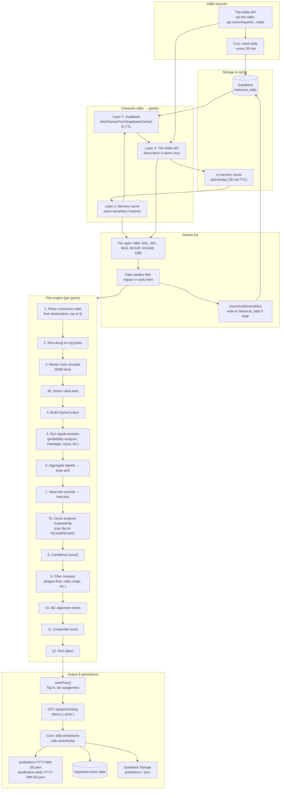

# Data Flow: Odds → Predictions (Progno)

End-to-end flow from when we obtain odds until bets are predicted and persisted.

---

## High-level diagram



---

## Step-by-step

### 1. Odds ingestion

| Source | When | Where it goes |
|--------|------|----------------|
| **The-Odds API** | Cron `track-odds` (~30 min) | Fetches per sport (NFL, NBA, NHL, MLB, NCAAF, NCAAB, CBB), builds snapshots, **stores in Supabase `historical_odds`** (flat rows: game_id, sport, home_team, away_team, bookmaker, market_type, odds, captured_at). |
| **The-Odds API** | On demand in `GET /api/picks/today` | Used as **Layer 3** when memory and Supabase cache miss. Response is cached in memory (30 min) and can be written to `historical_odds` via `checkAndStoreOdds()` if data is stale. |

### 2. Odds → games (picks/today)

For each sport, games are resolved in order:

1. **Layer 1 – Memory**
   Key: `{sport}_{earlyLines ? 'early' : 'regular'}`.
   If hit and &lt; 30 min old → use cached games.

2. **Layer 2 – Supabase**
   `fetchGamesFromSupabaseCache(sport)` reads from **`historical_odds`** (rows within last 2 hours), groups by `game_id`, reconstructs The-Odds-style `{ id, home_team, away_team, commence_time, bookmakers: [...] }`.
   If any games returned → use them and backfill memory cache.

3. **Layer 3 – The-Odds API**
   `GET https://api.the-odds-api.com/v4/sports/{sport}/odds/?apiKey=...&regions=us&markets=h2h,spreads,totals&oddsFormat=american`.
   On success, games are written to memory cache and optionally to **`historical_odds`** via `checkAndStoreOdds()` (if Supabase says odds are stale).

Optional: **early lines** use a 2–5 day window; **free early-line fallback** can supply games if the API returns nothing.

### 3. Per-game: runPickEngine(game, sport)

For each game in the date window:

1. **Consensus odds** – From `game.bookmakers` (up to 5 books): average moneyline, spread, total.
2. **Shin-devig** – No-vig home/away probabilities.
3. **Monte Carlo** – Simulate 5000 games; get win/spread/total probs; **detect value bets** (edge ≥ 5% or 10%).
4. **GameContext** – gameId, sport, teams, odds, no-vig probs, MC result, raw game.
5. **Signals** – All registered signal modules run in parallel; each returns confidenceDelta, favors (home/away/neutral), reasoning. Current signals:
     - **TrueEdge** – altitude, reverse line movement, public money.
     - **7D Claude Effect** – sentiment, sharp signal (spread vs ML), upset risk, temporal decay.
     - **Home/Away Bias** – backtest-validated +5/−5 home/away adjustment.
     - **Cevict 16-model Probability Analyzer** – ensemble of Bayesian, XGBoost, Neural Net, etc. Can flip pick for NCAAB/NCAAF.
     - **Massager v3** – spread-ML disagreement penalty, blowout spread confirmation, MC-odds convergence/divergence.
     - **Injury Impact** – reads Supabase `injuries` table (API-Sports), adjusts confidence based on team injury burden differential.
6. **Aggregate** – Base pick = side with higher vote weight (no-vig + signal deltas).
7. **Value bet override** – If best value bet has edge ≥ 5% (or ≥ 10%), set pick to that side/type/line.
8. **Analyzer flip** – Cevict analyzer can flip pick for NCAAB/NCAAF/NCAA if ensemble strongly disagrees.
9. **Confidence** – Single confidence value from confidence module.
10. **Filters** – League floor, odds range, underdog cap, etc. If any filter fails → **drop pick** (return null).
11. **MC alignment** – Check MC agrees with final pick (by bet type: moneyline/spread/total).
12. **Composite score** – Edge + EV + confidence; triple alignment bonus.
13. **Pick object** – Full pick with sport, teams, pick, pick_type, odds, confidence, value_bet_*, mc_*, reasoning, signal_trace.

### 4. Aggregation and ranking

- All sports’ picks are collected; **rankPicks()** (ranking module) sorts by composite score (and tier logic).
- **Top N** (e.g. 25) returned; optional **favorite-only** and **max per sport** applied earlier in the loop.
- Picks can be written to Supabase **`picks`** table inside the same request (if configured).

### 5. API response

- **GET /api/picks/today** (and optional `?earlyLines=1&date=YYYY-MM-DD`) returns
  `{ picks: [...], message, ... }`.

### 6. Cron: daily-predictions

- Runs on schedule (e.g. 8 AM CT); can be triggered with `?earlyLines=1` and/or `?date=YYYY-MM-DD`.
- Calls **GET /api/picks/today** (same app) with the chosen params.
- Normalizes numbers (confidence, EV, edge, etc.) and builds payload:
  - **Supabase** – Inserts into **`picks`** (or similar) for the run date.
  - **Supabase Storage** – Uploads **predictions-{date}.json** and **predictions-early-{date}.json**.
  - **Local** – Writes same JSON to app root when running in an environment with filesystem.
- Optionally **syndicates** to Prognostication (tiered); can run **Elite enhancer** before syndication.

---

## File and table reference

| Item | Role |
|------|------|
| **The-Odds API** | Live odds (and scores elsewhere). Primary source. |
| **Supabase `historical_odds`** | Persisted odds snapshots from track-odds and from picks/today (checkAndStoreOdds). Read by fetchGamesFromSupabaseCache. |
| **In-memory cache (picks/today)** | 30 min TTL per sport/early to avoid hitting The-Odds API every request. |
| **Supabase `picks`** | Persisted pick rows (from picks/today and/or daily-predictions cron). |
| **predictions-YYYY-MM-DD.json** | Daily predictions JSON (regular and early). Written by daily-predictions; also in Storage. |

---

## Mermaid (simplified linear)

```mermaid
flowchart LR
  A[The-Odds API] --> B[track-odds cron]
  B --> C[(historical_odds)]
  A --> D[picks/today Layer 3]
  C --> E[picks/today Layer 2]
  E --> F[Memory cache Layer 1]
  D --> F
  F --> G[Games per sport]
  G --> H[runPickEngine per game]
  H --> I[rankPicks]
  I --> J[/api/picks/today]
  J --> K[daily-predictions cron]
  K --> L[JSON + Supabase + Storage]
```

---

*Generated from apps/progno (picks/today, pick-engine, track-odds, daily-predictions).*
